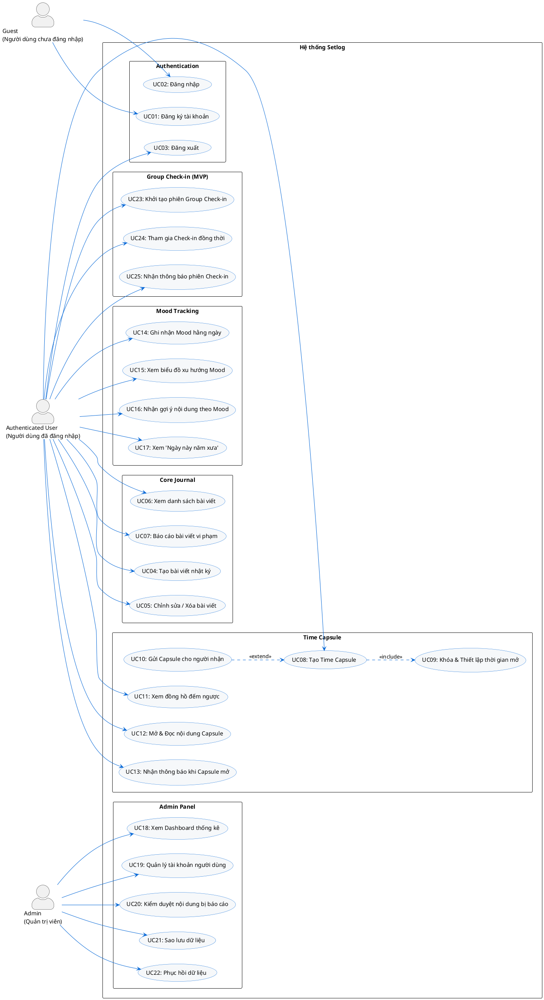

# TÀI LIỆU ĐẶC TẢ YÊU CẦU PHẦN MỀM (SRS)
# Dự án: Setlog — Nhật ký cá nhân tích hợp Time Capsule & Mood Tracking

---

---

## Mục lục

1. [Giới thiệu dự án](#1-giới-thiệu-dự-án)
2. [Danh sách Actors](#2-danh-sách-actors)
3. [Sơ đồ Use Case tổng thể](#3-sơ-đồ-use-case-tổng-thể)
4. [Đặc tả chi tiết Use Case](#4-đặc-tả-chi-tiết-use-case)
   - [4.1 Cụm Xác thực (Auth)](#41-cụm-xác-thực-auth)
   - [4.2 Cụm Nhật ký cá nhân (Core Journal)](#42-cụm-nhật-ký-cá-nhân-core-journal)
   - [4.3 Cụm Time Capsule](#43-cụm-time-capsule)
   - [4.4 Cụm Mood Tracking](#44-cụm-mood-tracking)
   - [4.5 Cụm Group Check-in (MVP)](#45-cụm-group-check-in-mvp)
   - [4.6 Cụm Admin Panel (Phạm vi mở rộng - Future Scope)](#46-cụm-admin-panel-phạm-vi-mở-rộng---future-scope)
5. [Yêu cầu chức năng (Functional Requirements - FRs)](#5-yêu-cầu-chức-năng-functional-requirements---frs)
6. [Yêu cầu phi chức năng (NFRs)](#6-yêu-cầu-phi-chức-năng-nfrs)

---

## 1. Giới thiệu dự án

Dự án được phát triển dựa trên phần mềm Setlog — một ứng dụng nhật ký cá nhân cho phép người dùng ghi lại khoảnh khắc và suy nghĩ hằng ngày. Trên nền tảng đó, hệ thống tập trung xây dựng ba cụm chức năng chính:

*   **Core Journal (MVP):** Nơi người dùng lưu trữ ký ức hàng ngày kèm theo nhãn chủ đề và cảm xúc tương ứng.
*   **Time Capsule (MVP):** Soạn thảo thư tương lai, thiết lập thời gian mở khóa. Thư có thể được gửi đến một hoặc nhiều người nhận trong hệ thống và bị khóa hoàn toàn cho tới khi đến hạn.
*   **Mood Tracking (MVP):** Theo dõi chỉ số cảm xúc hằng ngày, xem biểu đồ xu hướng 30 ngày, nhận gợi ý bài viết cũ dựa trên tâm trạng hiện tại và xem lại kỷ niệm "Ngày này năm xưa".
*   **Group Check-in (MVP):** Tính năng hỗ trợ thông báo đồng thời cho nhóm, thiết lập khung thời gian check-in giới hạn nhằm tạo cảm giác tương tác thời gian thực (real-time) và thúc đẩy tính kết nối giữa các thành viên.
*   **Admin Panel (Mở rộng):** Công cụ quản trị để quản lý tài khoản, kiểm duyệt báo cáo vi phạm và thực hiện sao lưu/phục hồi dữ liệu hệ thống (Không bắt buộc trong Sprint 1).

---

## 2. Danh sách Actors

### 2.1 Guest (Người dùng chưa đăng nhập)
**Định nghĩa:** Người dùng chưa thực hiện xác thực danh tính với hệ thống.
**Phạm vi truy cập:**
*   Chỉ được phép truy cập trang Đăng ký và trang Đăng nhập.
*   Khi cố truy cập các tài nguyên yêu cầu đăng nhập, hệ thống sẽ tự động chuyển hướng về trang Đăng nhập.

### 2.2 Authenticated User (Người dùng đã đăng nhập)
**Định nghĩa:** Người dùng đã xác thực thành công và sở hữu phiên làm việc hợp lệ.
**Phạm vi truy cập:**
*   **Bài viết nhật ký:** Tạo, xem danh sách, chi tiết, chỉnh sửa và xóa nhật ký cá nhân của mình.
*   **Time Capsule:** Tạo mới, thiết lập khóa, xem đồng hồ đếm ngược, và đọc nội dung sau khi capsule được mở khóa; gửi capsule cho người nhận khác; nhận thông báo khi capsule mở khóa; gửi báo cáo vi phạm đối với capsule nhận được.
*   **Mood Log:** Tạo và cập nhật tâm trạng hàng ngày, xem biểu đồ xu hướng cá nhân, nhận gợi ý và xem lại kỷ niệm "Ngày này năm xưa".
*   **Group Check-in:** Khởi tạo phiên check-in nhóm; Thiết lập khung thời gian giới hạn; Nhận thông báo check-in đồng thời; Xem và cập nhật trạng thái hoạt động real-time cùng các thành viên khác trong phiên nhóm.
*   **Hồ sơ người dùng khác:** Tìm kiếm theo Username để thêm vào danh sách người nhận Time Capsule hoặc danh sách thành viên phiên check-in nhóm.

### 2.3 Admin (Quản trị viên - Phạm vi mở rộng)
**Định nghĩa:** Tài khoản quản trị, có quyền quản lý hệ thống và xử lý nội dung báo cáo vi phạm.
**Phạm vi truy cập:** Xem dashboard thống kê hệ thống, quản lý tài khoản người dùng (khóa/mở khóa), kiểm duyệt Time Capsule bị báo cáo vi phạm (bác bỏ hoặc gỡ bỏ), thực hiện sao lưu và phục hồi dữ liệu hệ thống.

---

## 3. Sơ đồ Use Case tổng thể

Dưới đây là mã nguồn PlantUML cho sơ đồ Use Case Diagram chuẩn của hệ thống Setlog. Sơ đồ phân định rõ các phân hệ và xác định đầy đủ mối quan hệ giữa các tác nhân (Actors) và Use Cases.

---

## 4. Đặc tả chi tiết Use Case

---

### 4.1 Cụm Xác thực (Auth)

#### UC01: Đăng ký tài khoản
*   **Mô tả:** Người dùng chưa có tài khoản cung cấp thông tin cá nhân để khởi tạo tài khoản mới trên hệ thống.
*   **Tác nhân:** Guest.
*   **Điều kiện tiên quyết:** Chưa đăng nhập vào hệ thống.
*   **Điều kiện sau khi hoàn thành:** Tài khoản mới được khởi tạo ở trạng thái hoạt động (Active), tự động thiết lập phiên đăng nhập và chuyển hướng người dùng tới trang Dashboard.
*   **Luồng sự kiện chính:**
    1.  Người dùng nhấn chọn chức năng "Đăng ký" trên giao diện trang chủ.
    2.  Hệ thống hiển thị Form đăng ký bao gồm các trường: Username (bắt buộc), Email (bắt buộc), Mật khẩu (bắt buộc), Xác nhận mật khẩu (bắt buộc).
    3.  Người dùng nhập đầy đủ thông tin yêu cầu và nhấn nút "Đăng ký".
    4.  Hệ thống thực hiện kiểm tra tính hợp lệ của dữ liệu (đúng định dạng email, mật khẩu tối thiểu 8 ký tự, các trường bắt buộc không để trống).
    5.  Hệ thống thực hiện kiểm tra tính duy nhất của Username và Email trong cơ sở dữ liệu.
    6.  Hệ thống mã hóa mật khẩu một chiều và lưu trữ thông tin tài khoản mới ở trạng thái "Active".
    7.  Hệ thống tự động khởi tạo phiên làm việc (Session) và chuyển hướng người dùng về trang Dashboard cá nhân kèm thông báo thành công.
*   **Luồng ngoại lệ:**
    *   *EX-AUTH-01-01 (Dữ liệu rỗng hoặc không hợp lệ):* Định dạng email sai hoặc mật khẩu ngắn hơn 8 ký tự. Hệ thống hiển thị thông báo lỗi chi tiết tại trường tương ứng và giữ nguyên thông tin đã nhập hợp lệ.
    *   *EX-AUTH-01-02 (Mật khẩu xác nhận không khớp):* Mật khẩu nhập lại không trùng khớp. Hệ thống hiển thị thông báo lỗi tại trường "Xác nhận mật khẩu", yêu cầu nhập lại.
    *   *EX-AUTH-01-03 (Dữ liệu trùng lặp):* Username hoặc Email đã được đăng ký bởi người dùng khác. Hệ thống hiển thị thông báo: "Tên đăng nhập hoặc Email đã tồn tại trong hệ thống".

#### UC02: Đăng nhập
*   **Mô tả:** Người dùng đã có tài khoản thực hiện xác thực để truy cập vào các chức năng của hệ thống.
*   **Tác nhân:** Guest.
*   **Điều kiện tiên quyết:** Chưa đăng nhập vào hệ thống.
*   **Điều kiện sau khi hoàn thành:** Hệ thống tạo phiên làm việc (Session/Token) hợp lệ và chuyển hướng người dùng tới Dashboard cá nhân.
*   **Luồng sự kiện chính:**
    1.  Người dùng nhấn chọn chức năng "Đăng nhập".
    2.  Hệ thống hiển thị Form đăng nhập gồm các trường: Username hoặc Email, Mật khẩu.
    3.  Người dùng nhập thông tin và nhấn chọn nút "Đăng nhập".
    4.  Hệ thống thực hiện kiểm tra thông tin tài khoản trong cơ sở dữ liệu.
    5.  Hệ thống xác nhận thông tin chính xác, khởi tạo phiên làm việc của người dùng và chuyển hướng về trang Dashboard.
*   **Luồng ngoại lệ:**
    *   *EX-AUTH-02-01 (Sai thông tin đăng nhập):* Username/Email hoặc Mật khẩu không chính xác. Hệ thống hiển thị lỗi: "Tên đăng nhập hoặc mật khẩu không chính xác" (không chỉ rõ sai trường nào để bảo mật).
    *   *EX-AUTH-02-02 (Tài khoản bị khóa):* Tài khoản đã bị khóa bởi Admin (trạng thái Deactivated). Hệ thống hiển thị thông báo lỗi: "Tài khoản của bạn đã bị khóa. Vui lòng liên hệ Admin để được hỗ trợ".

#### UC03: Đăng xuất
*   **Mô tả:** Người dùng đang đăng nhập thực hiện kết thúc phiên làm việc hiện tại để bảo mật tài khoản.
*   **Tác nhân:** Authenticated User.
*   **Điều kiện tiên quyết:** Đã đăng nhập vào hệ thống và sở hữu phiên làm việc hợp lệ.
*   **Điều kiện sau khi hoàn thành:** Phiên đăng nhập bị hủy bỏ ở cả client và server, người dùng chuyển hướng về màn hình đăng nhập.
*   **Luồng sự kiện chính:**
    1.  Người dùng nhấn chọn biểu tượng avatar hoặc nút "Đăng xuất" trên thanh điều hướng.
    2.  Hệ thống gửi yêu cầu hủy phiên đăng nhập về phía server.
    3.  Hệ thống xóa sạch Session/Token ở client và vô hiệu hóa token trên server.
    4.  Hệ thống chuyển hướng người dùng về trang Đăng nhập kèm thông báo đăng xuất thành công.

---

### 4.2 Cụm Nhật ký cá nhân (Core Journal)

#### UC04: Tạo bài viết nhật ký
*   **Mô tả:** Người dùng viết và lưu lại bài nhật ký cá nhân hàng ngày kèm nhãn chủ đề và trạng thái cảm xúc tương ứng.
*   **Tác nhân:** Authenticated User.
*   **Điều kiện tiên quyết:** Đã đăng nhập vào hệ thống.
*   **Điều kiện sau khi hoàn thành:** Bài viết nhật ký được lưu trữ thành công trong cơ sở dữ liệu của người dùng.
*   **Luồng sự kiện chính:**
    1.  Người dùng nhấn chọn nút "Viết nhật ký" trên giao diện chính.
    2.  Hệ thống hiển thị Form soạn thảo nhật ký gồm các trường thông tin: Tiêu đề (bắt buộc), Nội dung nhật ký (bắt buộc), Mức độ cảm xúc (1-5, tùy chọn), Nhãn chủ đề (tùy chọn), Hình ảnh đính kèm (tùy chọn).
    3.  Người dùng hoàn thiện nội dung và nhấn nút "Lưu bài viết".
    4.  Hệ thống kiểm tra tính hợp lệ của dữ liệu đầu vào.
    5.  Hệ thống lưu bài viết kèm theo ID người dùng và mốc thời gian tạo hiện tại.
    6.  Hệ thống hiển thị thông báo thành công và tự động chuyển hướng người dùng về giao diện danh sách nhật ký.
*   **Luồng ngoại lệ:**
    *   *EX-JO-01-01 (Thông tin bắt buộc để trống):* Người dùng để trống trường Tiêu đề hoặc Nội dung. Hệ thống hiển thị thông báo lỗi "Vui lòng điền thông tin bắt buộc" dưới các trường tương ứng.
    *   *EX-JO-01-02 (Ảnh vượt quá dung lượng):* Hình ảnh tải lên có kích thước lớn hơn 5MB. Hệ thống từ chối tải ảnh và hiển thị thông báo lỗi: "Kích thước ảnh tối đa cho phép là 5MB".

#### UC05: Chỉnh sửa / Xóa bài viết
*   **Mô tả:** Người dùng thực hiện cập nhật nội dung hoặc xóa bài nhật ký đã viết trước đó.
*   **Tác nhân:** Authenticated User.
*   **Điều kiện tiên quyết:** Đã đăng nhập. Bài viết cần sửa/xóa phải thuộc quyền sở hữu của chính người dùng này.
*   **Điều kiện sau khi hoàn thành:** Bài viết được cập nhật nội dung mới hoặc được đánh dấu đã xóa (soft-delete)/xóa hoàn toàn khỏi cơ sở dữ liệu.
*   **Luồng sự kiện chính:**
    1.  Người dùng xem chi tiết bài nhật ký của mình.
    2.  Hệ thống hiển thị nội dung chi tiết bài viết kèm các nút chức năng "Chỉnh sửa" và "Xóa".
    3.  *If người dùng chọn "Chỉnh sửa" (Nhánh A):*
        - a1. Hệ thống hiển thị Form soạn thảo với dữ liệu cũ của bài viết.
        - a2. Người dùng sửa đổi thông tin và nhấn "Cập nhật".
        - a3. Hệ thống kiểm tra dữ liệu và lưu cập nhật, thông báo thành công.
    4.  *If người dùng chọn "Xóa" (Nhánh B):*
        - b1. Hệ thống hiển thị hộp thoại xác nhận: "Bạn có chắc chắn muốn xóa bài viết này không?".
        - b2. Người dùng nhấn chọn "Xác nhận xóa".
        - b3. Hệ thống chuyển trạng thái bài viết thành đã xóa (soft-delete) và ẩn khỏi giao diện hiển thị của người dùng.
*   **Luồng ngoại lệ:**
    *   *EX-JO-02-01 (Truy cập trái phép):* Người dùng cố tình sửa/xóa bài viết của người khác bằng cách thay đổi ID bài viết trên đường dẫn URL. Hệ thống phát hiện ID người tạo bài viết không trùng khớp với ID người dùng hiện tại, từ chối thực hiện và chuyển hướng tới trang lỗi 403 (Forbidden).

#### UC06: Xem danh sách bài viết
*   **Mô tả:** Người dùng xem danh sách các bài nhật ký của mình, hỗ trợ tìm kiếm và lọc nội dung.
*   **Tác nhân:** Authenticated User.
*   **Điều kiện tiên quyết:** Đã đăng nhập vào hệ thống.
*   **Điều kiện sau khi hoàn thành:** Danh sách bài viết được hiển thị trực quan theo thứ tự thời gian.
*   **Luồng sự kiện chính:**
    1.  Người dùng chọn mục "Nhật ký của tôi" trên thanh điều hướng.
    2.  Hệ thống truy vấn cơ sở dữ liệu để lấy toàn bộ các bài viết nhật ký thuộc sở hữu của người dùng hiện tại (không bao gồm các bài viết đã soft-delete), sắp xếp theo ngày tạo mới nhất.
    3.  Hệ thống hiển thị danh sách bài viết dưới dạng lưới hoặc danh sách, bao gồm: Tiêu đề, Ngày tạo, Nhãn chủ đề và Điểm số cảm xúc (nếu có).
*   **Luồng thay thế:**
    *   *ALT-JO-03-01 (Lọc danh sách):* Người dùng chọn lọc danh sách theo Nhãn chủ đề hoặc theo Mức độ cảm xúc (1-5). Hệ thống tự động lọc và hiển thị danh sách bài viết khớp với điều kiện đã chọn.
    *   *ALT-JO-03-02 (Tìm kiếm bài viết):* Người dùng nhập từ khóa vào thanh tìm kiếm. Hệ thống tiến hành lọc các bài viết có tiêu đề hoặc nội dung chứa từ khóa và hiển thị kết quả.

#### UC07: Báo cáo bài viết vi phạm
*   **Mô tả:** Người nhận của một Time Capsule phát hiện nội dung độc hại hoặc vi phạm điều khoản và tiến hành báo cáo lên quản trị viên.
*   **Tác nhân:** Authenticated User (Vai trò người nhận).
*   **Điều kiện tiên quyết:** Đã đăng nhập. Time Capsule được báo cáo phải gửi đến người dùng này và đã được mở khóa.
*   **Điều kiện sau khi hoàn thành:** Yêu cầu báo cáo được hệ thống ghi nhận và gửi vào hàng đợi xử lý của Admin.
*   **Luồng sự kiện chính:**
    1.  Người dùng mở đọc chi tiết một Time Capsule nhận được từ người khác (UC12).
    2.  Người dùng phát hiện nội dung vi phạm và nhấn nút "Báo cáo vi phạm".
    3.  Hệ thống hiển thị Form báo cáo gồm: Lý do báo cáo (chọn từ danh sách: Quấy rối, Ngôn từ kích động, Nội dung nhạy cảm, Khác) và trường nhập ý kiến chi tiết (bắt buộc).
    4.  Người dùng hoàn thành Form và nhấn nút "Gửi báo cáo".
    5.  Hệ thống kiểm tra thông tin, ghi nhận báo cáo vào cơ sở dữ liệu (lưu thông tin ID Capsule, ID người báo cáo, lý do, chi tiết và mốc thời gian), đồng thời gửi thông báo thành công cho người dùng.
*   **Luồng ngoại lệ:**
    *   *EX-JO-04-01 (Báo cáo không hợp lệ):* Người dùng cố tình báo cáo Time Capsule do chính mình tạo ra. Hệ thống phát hiện người tạo và người báo cáo trùng nhau, hiển thị thông báo từ chối: "Bạn không thể tự báo cáo Time Capsule của chính mình".

---

### 4.3 Cụm Time Capsule

#### UC08: Tạo Time Capsule
*   **Mô tả:** Người dùng khởi tạo một bức thư tương lai (Time Capsule) bao gồm tiêu đề, nội dung và các thiết lập liên quan.
*   **Tác nhân:** Authenticated User.
*   **Điều kiện tiên quyết:** Đã đăng nhập vào hệ thống.
*   **Điều kiện sau khi hoàn thành:** Time Capsule được khởi tạo thông tin thành công và chuẩn bị cho các bước khóa và gửi.
*   **Luồng sự kiện chính:**
    1.  Người dùng chọn chức năng "Tạo Time Capsule".
    2.  Hệ thống hiển thị Form soạn thảo gồm các trường: Tiêu đề (bắt buộc), Nội dung (bắt buộc).
    3.  Người dùng nhập đầy đủ tiêu đề và nội dung.
    4.  Hệ thống tự động lưu bản nháp định kỳ để tránh mất mát dữ liệu.
    5.  Người dùng tiến hành thiết lập thời gian mở khóa (UC09 - bắt buộc) và thêm người nhận (UC10 - tùy chọn).
    6.  Người dùng nhấn chọn "Lưu & Khóa". Hệ thống gọi chức năng UC09 để khóa capsule.
*   **Luồng ngoại lệ:**
    *   *EX-TC-01-01 (Thông tin rỗng):* Trường Tiêu đề hoặc Nội dung bị bỏ trống. Hệ thống hiển thị báo lỗi tại trường tương ứng và ngăn không cho thực hiện khóa.

#### UC09: Khóa & Thiết lập thời gian mở
*   **Mô tả:** Thiết lập thời điểm mở khóa cho Time Capsule trong tương lai và khóa hoàn toàn nội dung cho tới hạn.
*   **Tác nhân:** Authenticated User (được bao gồm trong UC08).
*   **Điều kiện tiên quyết:** Đang thực hiện tạo Time Capsule (UC08).
*   **Điều kiện sau khi hoàn thành:** Thời gian mở được xác nhận, nội dung Capsule được mã hóa/khóa hoàn toàn trên server.
*   **Luồng sự kiện chính:**
    1.  Hệ thống hiển thị lịch chọn ngày và giờ mở khóa Capsule.
    2.  Người dùng chọn ngày và giờ trong tương lai và nhấn xác nhận.
    3.  Hệ thống thực hiện kiểm tra tính hợp lệ của thời gian (phải cách thời điểm hiện tại tối thiểu 1 giờ).
    4.  Hệ thống tiến hành cập nhật trạng thái Capsule thành "Đã khóa", ẩn nội dung thô và lên lịch trình tự động mở khóa.
*   **Quy tắc nghiệp vụ:**
    *   *Thời gian khóa tối thiểu:* Tối thiểu 1 giờ kể từ thời điểm thiết lập.
    *   *Chế độ Demo (Demo Mode):* Để hỗ trợ kiểm thử và demo nhanh, người dùng có thể kích hoạt tùy chọn "Demo Mode" giúp rút ngắn thời gian khóa tối thiểu xuống còn **1 phút**.
*   **Luồng ngoại lệ:**
    *   *EX-TC-02-01 (Thời gian mở khóa không hợp lệ):* Ngày giờ được chọn nằm ở quá khứ hoặc khoảng cách thời gian nhỏ hơn quy định tối thiểu. Hệ thống báo lỗi: "Thời gian mở khóa không hợp lệ. Vui lòng chọn thời điểm tối thiểu cách hiện tại 1 giờ (hoặc 1 phút đối với Demo Mode)".

#### UC10: Gửi Capsule cho người nhận
*   **Mô tả:** Người tạo bổ sung danh sách những người nhận sẽ được quyền đọc Time Capsule khi nó được mở khóa.
*   **Tác nhân:** Authenticated User (đóng vai trò người tạo, mở rộng từ UC08).
*   **Điều kiện tiên quyết:** Đang thực hiện tạo Time Capsule (UC08) và trước khi bấm "Lưu & Khóa".
*   **Điểm mở rộng:** Trước khi nhấn nút "Lưu & Khóa" của UC08.
*   **Luồng sự kiện chính:**
    1.  Người dùng nhấn chọn mục "Thêm người nhận".
    2.  Hệ thống hiển thị ô tìm kiếm Username.
    3.  Người dùng nhập Username của người nhận mong muốn.
    4.  Hệ thống kiểm tra sự tồn tại của tài khoản trong cơ sở dữ liệu và hiển thị kết quả gợi ý.
    5.  Người dùng nhấn chọn người dùng từ kết quả gợi ý để thêm vào danh sách người nhận (cho phép thêm nhiều người).
    6.  Hệ thống ghi nhận danh sách người nhận và liên kết với Time Capsule đang tạo.
*   **Luồng ngoại lệ:**
    *   *EX-TC-03-01 (Không tìm thấy người nhận):* Username nhập vào không tồn tại hoặc tài khoản đó đang bị khóa (Deactivated). Hệ thống hiển thị thông điệp báo lỗi: "Không tìm thấy người dùng này trong hệ thống".

#### UC11: Xem đồng hồ đếm ngược
*   **Mô tả:** Cho phép người tạo hoặc người nhận xem thời gian còn lại cho tới khi Time Capsule được mở khóa.
*   **Tác nhân:** Authenticated User (Người tạo hoặc nằm trong danh sách người nhận).
*   **Điều kiện tiên quyết:** Đã đăng nhập. Time Capsule đang ở trạng thái "Đã khóa".
*   **Điều kiện sau khi hoàn thành:** Hiển thị đồng hồ đếm ngược cập nhật theo thời gian thực trên giao diện.
*   **Luồng sự kiện chính:**
    1.  Người dùng truy cập vào kho thư Time Capsule và chọn một capsule đang ở trạng thái "Đã khóa".
    2.  Hệ thống kiểm tra quyền truy cập (người dùng phải là người tạo hoặc người nhận có tên trong danh sách).
    3.  Hệ thống hiển thị tiêu đề thư, thông tin người gửi/người nhận, trạng thái "Đã khóa" và hiển thị bộ đếm ngược định dạng: Ngày - Giờ - Phút - Giây.
    4.  Bộ đếm tự động cập nhật giảm dần mỗi giây dựa trên thời gian thực hệ thống.
*   **Luồng ngoại lệ:**
    *   *EX-TC-04-01 (Không có quyền truy cập):* Người dùng không có quyền liên quan cố truy cập thông qua thay đổi ID trên URL. Hệ thống phát hiện vi phạm quyền, từ chối hiển thị và trả về trang lỗi 403.

#### UC12: Mở & Đọc nội dung Capsule
*   **Mô tả:** Người tạo hoặc người nhận tiến hành mở khóa và đọc nội dung chi tiết bên trong bức thư khi đến hạn.
*   **Tác nhân:** Authenticated User (Người tạo hoặc nằm trong danh sách người nhận).
*   **Điều kiện tiên quyết:** Đã đăng nhập. Thời gian hiện tại bằng hoặc lớn hơn thời gian mở khóa đã thiết lập.
*   **Điều kiện sau khi hoàn thành:** Trạng thái Capsule chuyển sang "Đã mở", nội dung thô hiển thị chi tiết cho người dùng có quyền.
*   **Luồng sự kiện chính:**
    1.  Người dùng truy cập Capsule từ danh sách hoặc click vào thông báo mở khóa (UC13).
    2.  Hệ thống kiểm tra quyền truy cập của người dùng.
    3.  Hệ thống kiểm tra thời gian hiện tại so với thời điểm mở khóa quy định.
    4.  Hệ thống thực hiện cập nhật trạng thái của Time Capsule từ "Đã khóa" thành "Đã mở" (nếu là lần đầu tiên mở).
    5.  Hệ thống giải mã nội dung và hiển thị chi tiết: Tiêu đề, Nội dung đầy đủ, Người gửi, Danh sách người nhận, và Ngày mở khóa.
*   **Luồng ngoại lệ:**
    *   *EX-TC-05-01 (Cố ý truy cập trước hạn):* Người dùng cố ý can thiệp URL để đọc nội dung khi thời gian khóa chưa hết. Hệ thống kiểm tra thấy chưa đến giờ mở, từ chối giải mã nội dung thô và tự động chuyển hướng về trang đồng hồ đếm ngược (UC11).
    *   *EX-TC-05-02 (Không có quyền đọc):* Tài khoản đăng nhập không phải là người tạo hay người nhận hợp lệ. Hệ thống hiển thị thông báo lỗi 403: "Bạn không có quyền xem thư này".

#### UC13: Nhận thông báo khi Capsule mở
*   **Mô tả:** Hệ thống tự động gửi thông báo cho các bên liên quan ngay khi Time Capsule được mở khóa.
*   **Tác nhân:** Authenticated User (Người tạo và người nhận).
*   **Điều kiện tiên quyết:** Đã đăng nhập. Có Time Capsule liên quan chuyển trạng thái sang "Đã mở".
*   **Điều kiện sau khi hoàn thành:** Thông báo được hiển thị trong mục thông báo (in-app notification) của người dùng.
*   **Luồng sự kiện chính:**
    1.  Hệ thống tự động chạy tác vụ nền (cron job/event handler) quét các Time Capsule đến hạn mở.
    2.  Hệ thống chuyển trạng thái các Capsule đến hạn sang "Đã mở" và tạo bản ghi thông báo gửi cho người tạo và tất cả người nhận.
    3.  Trên giao diện ứng dụng của người dùng, biểu tượng thông báo (chuông) tăng số lượng tin nhắn chưa đọc.
    4.  Người dùng click vào biểu tượng chuông để xem danh sách thông báo.
    5.  Hệ thống hiển thị thông tin: "Time Capsule '[Tiêu đề]' của bạn/từ [Người gửi] đã được mở khóa!".
    6.  Người dùng click vào dòng thông báo để được tự động chuyển hướng tới màn hình đọc nội dung chi tiết (UC12).

---

### 4.4 Cụm Mood Tracking

#### UC14: Ghi nhận Mood hằng ngày
*   **Mô tả:** Người dùng thực hiện ghi nhận mức độ cảm xúc, nhãn cảm xúc và ghi chú tâm trạng mỗi ngày.
*   **Tác nhân:** Authenticated User.
*   **Điều kiện tiên quyết:** Đã đăng nhập vào hệ thống.
*   **Điều kiện sau khi hoàn thành:** Dữ liệu cảm xúc của ngày hôm nay được lưu vào cơ sở dữ liệu, biểu đồ xu hướng được cập nhật.
*   **Luồng sự kiện chính:**
    1.  Người dùng chọn mục "Mood Tracker" trên menu chính.
    2.  Hệ thống kiểm tra xem hôm nay người dùng đã ghi nhận cảm xúc chưa.
        - *Nếu chưa ghi nhận:* Hệ thống hiển thị Form trống kèm nút "Lưu tâm trạng".
        - *Nếu đã ghi nhận:* Hệ thống hiển thị thông tin cũ kèm nút "Cập nhật".
    3.  Người dùng nhập thông tin: Chọn điểm cảm xúc (1: Rất tệ, 2: Tệ, 3: Bình thường, 4: Tốt, 5: Rất tốt), Nhập ghi chú tự do (tối đa 500 ký tự) và chọn các Nhãn cảm xúc tương ứng (ví dụ: vui vẻ, căng thẳng, mệt mỏi...).
    4.  Người dùng nhấn nút "Lưu" hoặc "Cập nhật".
    5.  Hệ thống kiểm tra tính hợp lệ dữ liệu và lưu vào cơ sở dữ liệu.
    6.  Hệ thống tự động hiển thị phần gợi ý nhật ký cũ (UC16) và kỷ niệm "Ngày này năm xưa" (UC17) ở phía dưới trang.
*   **Luồng ngoại lệ:**
    *   *EX-MT-01-01 (Chưa chọn điểm cảm xúc):* Người dùng nhấn Lưu nhưng bỏ trống điểm số 1-5. Hệ thống báo lỗi bắt buộc chọn điểm số cảm xúc.

#### UC15: Xem biểu đồ xu hướng Mood
*   **Mô tả:** Người dùng xem biểu đồ trực quan thể hiện sự thay đổi và xu hướng cảm xúc cá nhân.
*   **Tác nhân:** Authenticated User.
*   **Điều kiện tiên quyết:** Đã đăng nhập vào hệ thống.
*   **Điều kiện sau khi hoàn thành:** Biểu đồ xu hướng được hiển thị đầy đủ và rõ ràng trên giao diện.
*   **Luồng sự kiện chính:**
    1.  Người dùng truy cập màn hình "Mood Tracker".
    2.  Hệ thống truy vấn cơ sở dữ liệu để lấy danh sách các điểm số cảm xúc đã lưu của người dùng này trong 30 ngày gần nhất.
    3.  Hệ thống tự động vẽ biểu đồ xu hướng dạng đường (Line Chart) hoặc cột (Bar Chart) bằng SVG.
    4.  Người dùng có thể rê chuột (hover) vào từng điểm mốc thời gian để xem chi tiết nhãn cảm xúc và ghi chú đã nhập của ngày đó.

#### UC16: Nhận gợi ý nội dung theo Mood
*   **Mô tả:** Hệ thống phân tích tâm trạng hiện tại và tự động đưa ra các gợi ý bài viết cũ của chính người dùng để giúp họ giải tỏa hoặc lưu giữ cảm xúc.
*   **Tác nhân:** Authenticated User.
*   **Điều kiện tiên quyết:** Đã đăng nhập. Người dùng đã ghi nhận cảm xúc của ngày hôm nay (UC14) hoặc đang xem trang Mood Tracker.
*   **Điều kiện sau khi hoàn thành:** Danh sách bài viết gợi ý được hiển thị ở góc màn hình.
*   **Luồng sự kiện chính:**
    1.  Hệ thống đọc mức độ cảm xúc hiện tại của người dùng (từ 1 đến 5).
    2.  Hệ thống áp dụng Quy tắc nghiệp vụ gợi ý để lọc ra tối đa 5 bài viết nhật ký cũ của chính người dùng này.
    3.  Hệ thống hiển thị danh sách các bài viết gợi ý (bao gồm Tiêu đề, Ngày viết, Trích dẫn ngắn).
    4.  Người dùng click vào tiêu đề để mở xem lại bài viết đó.
*   **Quy tắc nghiệp vụ gợi ý:**
    *   *Điểm 1 (Rất tệ) & Điểm 2 (Tệ):* Lọc các bài viết cũ có nhãn "Đồng cảm", "Vượt khó", "Chia sẻ".
    *   *Điểm 3 (Bình thường):* Lọc các bài viết cũ có nhãn "Thư giãn", "Cuộc sống thường nhật".
    *   *Điểm 4 (Tốt) & Điểm 5 (Rất tốt):* Lọc các bài viết cũ có nhãn "Thành tựu", "Du lịch", "Khám phá", "Biết ơn".
*   **Luồng ngoại lệ:**
    *   *EX-MT-03-01 (Không tìm thấy bài viết phù hợp):* Không có bài viết nào trong lịch sử thỏa mãn điều kiện nhãn. Hệ thống hiển thị thông điệp: "Hãy tiếp tục viết nhật ký để nhận được những gợi ý tâm trạng phù hợp nhé!".

#### UC17: Xem 'Ngày này năm xưa'
*   **Mô tả:** Hệ thống hiển thị lại các bài nhật ký được viết vào đúng ngày này của các năm trước.
*   **Tác nhân:** Authenticated User.
*   **Điều kiện tiên quyết:** Đã đăng nhập vào hệ thống.
*   **Điều kiện sau khi hoàn thành:** Khối kỷ niệm hiển thị bài viết cũ (nếu có).
*   **Luồng sự kiện chính:**
    1.  Khi người dùng truy cập giao diện Mood Tracker hoặc Dashboard, hệ thống tự động kiểm tra cơ sở dữ liệu.
    2.  Hệ thống tìm kiếm các bài viết nhật ký của người dùng có ngày và tháng tạo trùng với ngày và tháng hiện tại, nhưng khác năm (ví dụ: ngày 31/05 ở các năm 2025, 2024...).
    3.  Nếu tìm thấy, hệ thống hiển thị khối "Ngày này năm xưa" gồm thông điệp "Ngày này [N] năm trước của bạn", tiêu đề bài viết và một đoạn trích ngắn.
    4.  Người dùng click vào để mở xem lại toàn bộ nội dung bài viết cũ đó.
*   **Luồng ngoại lệ:**
    *   *EX-MT-04-01 (Không có dữ liệu trùng ngày):* Không tìm thấy bài viết nào đáp ứng điều kiện trùng ngày-tháng. Hệ thống tự động ẩn khối "Ngày này năm xưa" để giữ giao diện gọn gàng.

---

### 4.5 Cụm Group Check-in (MVP)

#### UC23: Khởi tạo phiên Group Check-in
*   **Mô tả:** Người dùng bắt đầu một phiên check-in nhóm với khung thời gian đếm ngược giới hạn để mời các thành viên khác cùng tham gia hoạt động đồng thời.
*   **Tác nhân:** Authenticated User.
*   **Điều kiện tiên quyết:** Đã đăng nhập vào hệ thống.
*   **Điều kiện sau khi hoàn thành:** Phiên Group Check-in được khởi tạo ở trạng thái hoạt động ("Active"), hệ thống tự động gửi thông báo đồng thời (push notification) cho tất cả thành viên trong danh sách.
*   **Luồng sự kiện chính:**
    1.  Người dùng chọn chức năng "Khởi tạo phiên Group Check-in" trên giao diện.
    2.  Hệ thống hiển thị Form khởi tạo bao gồm các trường: Tiêu đề phiên (bắt buộc), Thời gian giới hạn đếm ngược (phút, bắt buộc), Tìm kiếm và chọn Danh sách thành viên (bắt buộc).
    3.  Người dùng nhập tiêu đề, thiết lập thời gian đếm ngược và chọn các thành viên trong nhóm.
    4.  Người dùng nhấn nút "Kích hoạt phiên".
    5.  Hệ thống kiểm tra dữ liệu hợp lệ (thời gian đếm ngược phải lớn hơn 0, tiêu đề không được để trống, danh sách thành viên tối thiểu 1 người).
    6.  Hệ thống tạo phiên check-in mới ở trạng thái "Active", ghi nhận mốc thời gian bắt đầu và thời gian đếm ngược.
    7.  Hệ thống tự động kích hoạt UC25 để gửi thông báo đồng thời cho toàn bộ thành viên được chọn.
    8.  Hệ thống chuyển hướng người khởi tạo đến giao diện theo dõi chung của phiên check-in nhóm.
*   **Luồng ngoại lệ:**
    *   *EX-GC-01-01 (Thời gian giới hạn không hợp lệ):* Người dùng thiết lập thời gian đếm ngược nhỏ hơn hoặc bằng 0 phút. Hệ thống báo lỗi "Thời gian đếm ngược phải lớn hơn 0 phút" và yêu cầu điều chỉnh lại.
    *   *EX-GC-01-02 (Thông tin bắt buộc để trống):* Tiêu đề bị bỏ trống hoặc danh sách thành viên trống. Hệ thống hiển thị thông báo lỗi tại trường tương ứng.

#### UC24: Tham gia Check-in đồng thời
*   **Mô tả:** Các thành viên trong nhóm tham gia vào phiên check-in, xem đồng hồ đếm ngược và cập nhật nhanh trạng thái hoạt động hiện tại của mình lên bảng theo dõi chung.
*   **Tác nhân:** Authenticated User (Các thành viên được chọn tham gia).
*   **Điều kiện tiên quyết:** Đã đăng nhập. Có tên trong danh sách thành viên của phiên Group Check-in đang ở trạng thái "Active".
*   **Điều kiện sau khi hoàn thành:** Trạng thái check-in của người dùng được cập nhật tức thời lên bảng theo dõi chung của nhóm.
*   **Luồng sự kiện chính:**
    1.  Người dùng click vào thông báo nhận được (UC25) hoặc chọn phiên đang hoạt động từ danh sách phiên nhóm.
    2.  Hệ thống kiểm tra quyền truy cập và hiển thị giao diện chung của phiên check-in nhóm.
    3.  Giao diện hiển thị: Tiêu đề phiên, Danh sách thành viên và trạng thái check-in của họ, Đồng hồ đếm ngược (countdown) hiển thị số phút/giây còn lại cập nhật theo thời gian thực (real-time).
    4.  Người dùng chọn nhanh một Trạng thái hoạt động (Đang học, Đang ăn, Đang làm việc...) hoặc nhập trạng thái tùy chỉnh, sau đó nhấn nút "Gửi Check-in".
    5.  Hệ thống kiểm tra thời gian đếm ngược hiện tại của phiên (phải lớn hơn 0).
    6.  Hệ thống lưu trữ trạng thái check-in của người dùng kèm mốc thời gian gửi, đồng thời tự động cập nhật tức thời (real-time) lên giao diện theo dõi chung của toàn bộ các thành viên khác đang trực tuyến.
*   **Luồng ngoại lệ:**
    *   *EX-GC-02-01 (Hết thời gian check-in):* Người dùng gửi check-in khi đồng hồ đếm ngược đã về 0 (phiên đã hết hạn). Hệ thống từ chối lưu trạng thái, hiển thị cảnh báo: "Phiên check-in đã kết thúc. Bạn không thể cập nhật trạng thái", đồng thời vô hiệu hóa form nhập liệu.
    *   *EX-GC-02-02 (Gửi yêu cầu trùng lặp):* Người dùng gửi lại check-in lần thứ hai trong cùng một phiên đang hoạt động. Hệ thống sẽ ghi đè trạng thái và ghi chú mới nhất của người dùng lên bảng theo dõi chung, đồng thời cập nhật lại mốc thời gian check-in mới.

#### UC25: Nhận thông báo phiên Check-in
*   **Mô tả:** Hệ thống gửi thông báo đồng thời cho các thành viên khi một phiên check-in nhóm được khởi tạo để họ tham gia kịp thời.
*   **Tác nhân:** Authenticated User (Các thành viên trong nhóm).
*   **Điều kiện tiên quyết:** Đã đăng nhập. Có phiên Group Check-in liên quan vừa được kích hoạt (UC23).
*   **Điều kiện sau khi hoàn thành:** Người dùng nhận được thông báo đẩy trên thiết bị và có thể truy cập thẳng vào phiên check-in.
*   **Luồng sự kiện chính:**
    1.  Ngay khi phiên check-in được khởi tạo thành công (UC23), hệ thống tự động gửi thông báo đẩy (push notification) đồng thời đến các thành viên được chỉ định.
    2.  Người dùng nhận được thông báo đẩy dưới dạng: "Bạn được mời tham gia check-in phiên '[Tiêu đề phiên]' cùng nhóm!".
    3.  Người dùng nhấn chọn thông báo, hệ thống xác thực quyền và tự động chuyển hướng người dùng thẳng đến giao diện tham gia check-in của phiên (UC24).

---

### 4.6 Cụm Admin Panel (Phạm vi mở rộng - Future Scope)

#### UC18: Xem Dashboard thống kê
*   **Mô tả:** Quản trị viên xem các số liệu thống kê tổng quan về tình hình hoạt động của hệ thống.
*   **Tác nhân:** Admin.
*   **Điều kiện tiên quyết:** Đã đăng nhập bằng tài khoản Admin.
*   **Điều kiện sau khi hoàn thành:** Hiển thị các biểu đồ, chỉ số hoạt động hệ thống.
*   **Luồng sự kiện chính:**
    1.  Admin nhấn chọn mục "Dashboard thống kê" trên menu quản trị.
    2.  Hệ thống thực hiện truy vấn cơ sở dữ liệu để tổng hợp: Tổng số người dùng đăng ký, số người dùng hoạt động hàng ngày (DAU), tổng số bài nhật ký được viết, tổng số Time Capsule đang khóa/đã mở và số lượng báo cáo vi phạm đang chờ xử lý.
    3.  Hệ thống hiển thị các số liệu dạng thẻ chỉ số và biểu đồ thống kê xu hướng tăng trưởng.

#### UC19: Quản lý tài khoản người dùng
*   **Mô tả:** Admin thực hiện khóa hoặc mở khóa tài khoản của người dùng trong hệ thống dựa trên hành vi sử dụng.
*   **Tác nhân:** Admin.
*   **Điều kiện tiên quyết:** Đã đăng nhập bằng tài khoản Admin.
*   **Điều kiện sau khi hoàn thành:** Trạng thái tài khoản người dùng được cập nhật trong cơ sở dữ liệu.
*   **Luồng sự kiện chính:**
    1.  Admin truy cập trang "Quản lý tài khoản người dùng".
    2.  Hệ thống hiển thị danh sách toàn bộ người dùng gồm: ID, Username, Email, Ngày tạo, Trạng thái (Active/Deactivated).
    3.  Admin có thể tìm kiếm người dùng theo Username hoặc lọc theo trạng thái.
    4.  Admin chọn tài khoản cần xử lý và nhấn nút "Khóa tài khoản" hoặc "Mở khóa".
    5.  Hệ thống hiển thị hộp thoại yêu cầu xác nhận thao tác.
    6.  Admin bấm chọn "Xác nhận".
    7.  Hệ thống cập nhật trạng thái mới của người dùng trong cơ sở dữ liệu, ghi nhật ký hoạt động (Audit Log) và hiển thị thông báo thành công.
*   **Quy tắc nghiệp vụ:**
    - Tài khoản khi ở trạng thái Deactivated sẽ không thể thực hiện đăng nhập ở UC02. Nếu người dùng đang trực tuyến khi bị khóa tài khoản, hệ thống sẽ tự động hủy phiên đăng nhập (Session) của họ ngay lập tức.

#### UC20: Kiểm duyệt nội dung bị báo cáo
*   **Mô tả:** Admin kiểm tra các Time Capsule bị báo cáo vi phạm nội dung và đưa ra quyết định xử lý phù hợp.
*   **Tác nhân:** Admin.
*   **Điều kiện tiên quyết:** Đã đăng nhập bằng tài khoản Admin.
*   **Điều kiện sau khi hoàn thành:** Báo cáo được xử lý, trạng thái nội dung bị báo cáo được cập nhật, ghi nhận lịch sử kiểm duyệt.
*   **Luồng sự kiện chính:**
    1.  Admin truy cập mục "Kiểm duyệt nội dung bị báo cáo".
    2.  Hệ thống hiển thị danh sách các Time Capsule đang bị báo cáo (chưa xử lý) kèm lý do và thông tin người báo cáo.
    3.  Admin nhấn chọn một báo cáo để xem chi tiết nội dung của Time Capsule bị báo cáo đó.
    4.  *Nếu Admin quyết định giữ nguyên nội dung (Bác bỏ báo cáo):*
        - a1. Admin chọn "Bác bỏ báo cáo".
        - a2. Hệ thống cập nhật trạng thái báo cáo thành "Đã bác bỏ", giữ nguyên trạng thái Capsule.
    5.  *Nếu Admin quyết định gỡ bỏ nội dung (Chấp nhận báo cáo):*
        - b1. Admin chọn "Gỡ bỏ nội dung".
        - b2. Hệ thống chuyển trạng thái Capsule thành "Đã ẩn do vi phạm", gửi thông báo cảnh cáo tự động đến tài khoản của người gửi Capsule.
    6.  Hệ thống ghi nhận chi tiết hành động vào Audit Log hệ thống (gồm tên Admin, ID Capsule, hành động xử lý và thời gian).
*   **Quy tắc nghiệp vụ:**
    - Để phục vụ kiểm duyệt, Admin chỉ được quyền xem chi tiết nội dung của những Time Capsule **đã bị báo cáo vi phạm**. Admin tuyệt đối không được truy cập hay đọc các thư Time Capsule đang khóa hoặc không bị báo cáo.

#### UC21: Sao lưu dữ liệu
*   **Mô tả:** Admin thực hiện tạo bản sao lưu vật lý cho toàn bộ dữ liệu của hệ thống để phòng ngừa sự cố.
*   **Tác nhân:** Admin.
*   **Điều kiện tiên quyết:** Đã đăng nhập bằng tài khoản Admin.
*   **Điều kiện sau khi hoàn thành:** File sao lưu được tạo thành công trên máy chủ và hiển thị trong danh sách lịch sử sao lưu.
*   **Luồng sự kiện chính:**
    1.  Admin truy cập mục "Sao lưu & Phục hồi".
    2.  Admin nhấn chọn nút "Tạo bản sao lưu mới".
    3.  Hệ thống tiến hành kết xuất (dump) toàn bộ cơ sở dữ liệu của hệ thống.
    4.  Hệ thống nén tệp tin dưới dạng `.zip`/`.sql`, đặt tên theo mốc thời gian và lưu vào thư mục lưu trữ bảo mật trên máy chủ.
    5.  Hệ thống cập nhật danh sách lịch sử sao lưu trên giao diện kèm dung lượng file và nút "Tải về".
    6.  Hệ thống hiển thị thông báo sao lưu dữ liệu thành công.
*   **Luồng ngoại lệ:**
    *   *EX-AD-04-01 (Lỗi đĩa đầy):* Bộ nhớ máy chủ không đủ để tạo file sao lưu. Hệ thống dừng thao tác và hiển thị cảnh báo lỗi: "Không thể thực hiện sao lưu do bộ nhớ máy chủ đầy".

#### UC22: Phục hồi dữ liệu
*   **Mô tả:** Admin khôi phục lại trạng thái dữ liệu hệ thống từ một bản sao lưu đã được tạo trước đó.
*   **Tác nhân:** Admin.
*   **Điều kiện tiên quyết:** Đã đăng nhập bằng tài khoản Admin. Có ít nhất một bản sao lưu hợp lệ trong lịch sử.
*   **Điều kiện sau khi hoàn thành:** Cơ sở dữ liệu hệ thống được ghi đè về trạng thái của file sao lưu được chọn.
*   **Luồng sự kiện chính:**
    1.  Admin truy cập mục "Sao lưu & Phục hồi".
    2.  Admin chọn một file sao lưu trong danh sách lịch sử và nhấn chọn nút "Phục hồi dữ liệu".
    3.  Hệ thống hiển thị hộp thoại cảnh báo nghiêm trọng và yêu cầu Admin nhập chuỗi xác nhận `CONFIRM` (phân biệt chữ hoa chữ thường).
    4.  Admin nhập chuỗi `CONFIRM` và nhấn nút "Bắt đầu phục hồi".
    5.  Hệ thống kích hoạt "Chế độ bảo trì", ngắt kết nối và chặn tạm thời mọi truy cập từ người dùng thường (client hiển thị màn hình bảo trì).
    6.  Hệ thống thực hiện nhập (import) dữ liệu từ file sao lưu đã chọn để ghi đè cơ sở dữ liệu hiện tại.
    7.  Hệ thống hoàn tất phục hồi, tắt chế độ bảo trì, khởi động lại các tiến trình và ghi nhận hành động phục hồi vào Audit Log.
    8.  Hệ thống hiển thị thông báo phục hồi thành công.
*   **Luồng ngoại lệ:**
    *   *EX-AD-05-01 (Nhập sai chuỗi xác nhận):* Admin nhập chuỗi xác nhận không chính xác. Hệ thống hủy bỏ thao tác phục hồi và thông báo: "Xác nhận không thành công. Chuỗi nhập vào không khớp".
    *   *EX-AD-05-02 (File sao lưu bị hỏng):* Hệ thống phát hiện file sao lưu bị lỗi trong quá trình import. Hệ thống tự động khôi phục (rollback) về trạng thái dữ liệu ngay trước khi phục hồi, tắt chế độ bảo trì và hiển thị cảnh báo: "Lỗi! File sao lưu bị hỏng. Dữ liệu đã được khôi phục nguyên trạng".

---

## 5. Yêu cầu chức năng (Functional Requirements - FRs)

Dưới đây là danh sách các yêu cầu chức năng (FR) được chuẩn hóa và đánh mã của hệ thống Setlog. Mỗi Use Case trong tài liệu đặc tả đều được ánh xạ tương ứng tới các yêu cầu chức năng này.

| Mã FR | Tên Yêu cầu Chức năng | Use Case ánh xạ |
|---|---|---|
| **FR-AUTH-01** | Cho phép người dùng đăng ký tài khoản mới bằng cách nhập Username, Email, Mật khẩu và Xác nhận mật khẩu. | UC01 |
| **FR-AUTH-02** | Kiểm tra định dạng dữ liệu đầu vào và tính duy nhất của Username/Email khi đăng ký tài khoản. | UC01 |
| **FR-AUTH-03** | Cho phép người dùng đăng nhập hệ thống bằng cách nhập Username/Email và Mật khẩu. | UC02 |
| **FR-AUTH-04** | Khởi tạo phiên làm việc (Session/Token) bảo mật và chuyển hướng người dùng khi đăng nhập thành công. | UC02 |
| **FR-AUTH-05** | Ngăn chặn đăng nhập đối với tài khoản đã bị khóa (Deactivated) và hiển thị thông báo liên hệ Admin. | UC02 |
| **FR-AUTH-06** | Hủy bỏ hoàn toàn phiên làm việc của người dùng hiện tại ở cả client và server khi đăng xuất. | UC03 |
| **FR-JO-01** | Cho phép người dùng tạo bài viết nhật ký mới với các trường: Tiêu đề, Nội dung, Cảm xúc (1-5), Nhãn chủ đề, và Ảnh đính kèm. | UC04 |
| **FR-JO-02** | Giới hạn kích thước file hình ảnh đính kèm trong bài nhật ký tối đa là 5MB. | UC04 |
| **FR-JO-03** | Cho phép người dùng chỉnh sửa nội dung của các bài viết nhật ký do chính họ sở hữu. | UC05 |
| **FR-JO-04** | Cho phép người dùng xóa bài viết nhật ký của mình (hỗ trợ xóa mềm để có thể khôi phục). | UC05 |
| **FR-JO-05** | Ngăn chặn các tài khoản khác sửa/xóa bài nhật ký không thuộc sở hữu và trả về mã lỗi 403. | UC05 |
| **FR-JO-06** | Hiển thị danh sách các bài viết nhật ký của người dùng hiện tại, sắp xếp mặc định từ mới nhất đến cũ nhất. | UC06 |
| **FR-JO-07** | Cung cấp bộ lọc bài viết theo nhãn chủ đề, điểm cảm xúc và tìm kiếm theo từ khóa trong tiêu đề/nội dung. | UC06 |
| **FR-JO-08** | Cho phép người nhận gửi báo cáo vi phạm đối với nội dung Time Capsule nhận được lên Admin. | UC07 |
| **FR-TC-01** | Cho phép người dùng soạn thảo Time Capsule mới gồm Tiêu đề và Nội dung. | UC08 |
| **FR-TC-02** | Cho phép người dùng thiết lập thời gian mở khóa trong tương lai cho Time Capsule. | UC09 |
| **FR-TC-03** | Mã hóa nội dung thô và chặn mọi quyền đọc/truy cập đối với các Time Capsule đang ở trạng thái khóa. | UC09 |
| **FR-TC-04** | Hỗ trợ "Demo Mode" cho phép thiết lập thời gian khóa tối thiểu của Time Capsule là 1 phút thay vì 1 giờ. | UC09 |
| **FR-TC-05** | Cho phép người dùng tìm kiếm tài khoản khác qua Username và thêm họ làm người nhận của Time Capsule. | UC10 |
| **FR-TC-06** | Hiển thị đồng hồ đếm ngược thời gian thực (ngày, giờ, phút, giây) của Time Capsule đang khóa đối với người gửi/nhận. | UC11 |
| **FR-TC-07** | Tự động chuyển trạng thái của Time Capsule sang "Đã mở" khi đến mốc thời gian mở khóa. | UC12 |
| **FR-TC-08** | Giải mã và hiển thị chi tiết nội dung Time Capsule đã mở khóa cho người gửi và người nhận hợp lệ. | UC12 |
| **FR-TC-09** | Tự động gửi thông báo trong ứng dụng cho người tạo và người nhận ngay khi Time Capsule được mở khóa. | UC13 |
| **FR-MT-01** | Cho phép người dùng ghi nhận mức độ cảm xúc hàng ngày (1-5), nhãn cảm xúc và ghi chú cá nhân (tối đa 500 ký tự). | UC14 |
| **FR-MT-02** | Hỗ trợ ghi đè/cập nhật lại bản ghi cảm xúc nếu người dùng thực hiện ghi nhận nhiều lần trong cùng một ngày. | UC14 |
| **FR-MT-03** | Tự động vẽ biểu đồ trực quan (đường hoặc cột) thể hiện xu hướng biến động cảm xúc trong 30 ngày gần nhất. | UC15 |
| **FR-MT-04** | Tự động gợi ý tối đa 5 bài nhật ký cũ của người dùng dựa trên mức độ cảm xúc được ghi nhận hôm nay. | UC16 |
| **FR-MT-05** | Tự động tìm kiếm và hiển thị khối thông tin ký ức "Ngày này năm xưa" nếu có bài viết trùng ngày-tháng trong lịch sử. | UC17 |
| **FR-GC-01** | Cho phép người dùng khởi tạo phiên Group Check-in mới với tiêu đề, thời gian đếm ngược (phút) và danh sách thành viên (báo lỗi nếu thời gian giới hạn đếm ngược nhỏ hơn hoặc bằng 0). | UC23 |
| **FR-GC-02** | Tự động gửi thông báo đồng thời (push notification) cho toàn bộ các thành viên được chỉ định ngay khi phiên check-in nhóm được kích hoạt. | UC23, UC25 |
| **FR-GC-03** | Hiển thị giao diện chung của phiên check-in nhóm có đồng hồ đếm ngược hiển thị theo thời gian thực (real-time) cho tất cả thành viên. | UC24 |
| **FR-GC-04** | Cho phép các thành viên lựa chọn trạng thái hoạt động hiện tại (Đang học, Đang ăn, Đang làm việc...) và gửi check-in (Hỗ trợ ghi đè/cập nhật lại trạng thái nếu gửi nhiều lần trong cùng một phiên). | UC24 |
| **FR-GC-05** | Tự động cập nhật tức thời (real-time) và hiển thị trạng thái check-in của các thành viên lên bảng theo dõi chung của phiên. | UC24 |
| **FR-GC-06** | Tự động vô hiệu hóa quyền check-in của thành viên và khóa lưu trữ thông tin khi đồng hồ đếm ngược của phiên kết thúc (về 0). | UC24 |
| **FR-AD-01** | Cung cấp màn hình Dashboard hiển thị biểu đồ và số liệu thống kê tổng hợp hoạt động của hệ thống cho Admin. | UC18 |
| **FR-AD-02** | Hiển thị danh sách tài khoản người dùng và cho phép Admin thay đổi trạng thái hoạt động (khóa/kích hoạt lại). | UC19 |
| **FR-AD-03** | Hủy phiên đăng nhập của người dùng ngay lập tức khi tài khoản của họ bị Admin khóa. | UC19 |
| **FR-AD-04** | Hiển thị danh sách các báo cáo vi phạm và cho phép Admin xem nội dung chi tiết của Time Capsule bị báo cáo. | UC20 |
| **FR-AD-05** | Cho phép Admin phê duyệt xử lý báo cáo: bác bỏ báo cáo hoặc gỡ bỏ hoàn toàn Capsule vi phạm. | UC20 |
| **FR-AD-06** | Cho phép Admin tạo bản sao lưu cơ sở dữ liệu hệ thống dưới dạng tệp nén bảo mật lưu trên máy chủ hoặc tải về. | UC21 |
| **FR-AD-07** | Cho phép Admin khôi phục cơ sở dữ liệu từ file sao lưu cũ sau khi nhập đúng chuỗi xác nhận `CONFIRM`. | UC22 |
| **FR-AD-08** | Tự động chuyển hệ thống sang "Chế độ bảo trì" (ngắt kết nối client) trong suốt quá trình phục hồi dữ liệu. | UC22 |

---

## 6. Yêu cầu phi chức năng (NFRs)

### 6.1 Độ bảo mật & Riêng tư (Security & Privacy)
*   **Mật mã hóa:** Mật khẩu người dùng bắt buộc phải được mã hóa một chiều (hashing sử dụng thuật toán băm mạnh kèm muối như bcrypt) trước khi lưu trữ dưới cơ sở dữ liệu.
*   **Quyền riêng tư dữ liệu nhật ký:** Nội dung bài viết nhật ký cá nhân và Time Capsule khi chưa mở khóa tuyệt đối không được hiển thị cho bất kỳ bên thứ ba nào (bao gồm cả Admin, ngoại trừ thông tin tiêu đề/nội dung bài viết bị báo cáo vi phạm trong màn hình kiểm duyệt của Admin).
*   **Bảo vệ Time Capsule:** Nội dung của Time Capsule đang khóa không được phép truyền tải về phía Client dưới dạng thô để tránh việc người dùng sử dụng các công cụ kiểm tra API hoặc Inspect Element để đọc trước hạn. Dữ liệu chỉ được giải mã và gửi từ server sau khi đã kiểm tra thời gian hợp lệ.

### 6.2 Hiệu năng (Performance)
*   **Thời gian phản hồi:** Thời gian tải danh sách nhật ký và vẽ biểu đồ SVG Mood Tracking phải dưới 1.0 giây trong điều kiện kết nối mạng tiêu chuẩn (3G/4G/Wifi thông thường).
*   **Đồng hồ đếm ngược:** Đồng hồ đếm ngược của Time Capsule (UC11) và Group Check-in (UC24) phải hoạt động mượt mà, cập nhật mỗi giây một lần mà không gây treo/đơ trình duyệt hoặc tiêu tốn quá nhiều CPU của client.

### 6.3 Tính khả dụng (Usability)
*   **Giao diện đáp ứng (Responsive Layout):** Hệ thống giao diện phải được tối ưu hóa hiển thị tốt trên cả hai môi trường: Desktop (màn hình rộng) và Mobile (các dòng điện thoại thông minh tiêu chuẩn).
*   **Thiết kế thẩm mỹ:** Áp dụng phong cách tối giản, hiện đại, hỗ trợ chế độ tối (Dark Mode) để bảo vệ mắt người dùng khi viết nhật ký vào ban đêm.
